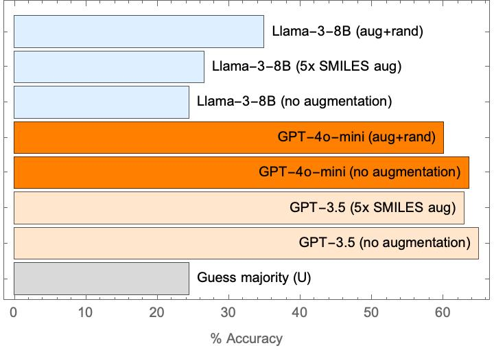

# SeparationLLM

 Language-interfaced fine-tuning for f-element separation demonstration.

# Data

 Source data was collected by L. Augustine in `data/Monoamide_Literature_Review.xlsx`.  
 - Retain only entries with a single metal species and single ligand, from the nitrate-containing spreadsheet (sheet 2)

 This is reprocessed into sentence format: *"0.5 M of CCCCCCN(CCCCCC)C(=O)CCCCC in toluene is used to extract 50 mM Th(IV) from an aqueous solution of 4 M HNO3 and 4 M nitrate at 20 C. The contact time is 10 min and the radiolytic dosage is 0 kGy"*

 All quantities are cast down to 1 significant figure.

 System prompt: *You are an expert liquid-liquid extraction chemist. Use the provided experiment description to predict the extraction selectivity. Return only VL, L, U, M, H.*

 The task is to predict the distribution coefficient:
 - (Very Low: VL) D <= 0.01  (about 10%)
 - (Low: L) D <= 0.3 (about 25%)
 - (Unselective: U)  0.3 < D < 3 (about 35%)
 - (Moderate: M)   D < 10 (about 22%)
 - (High: H)   D >= 10 (about 8%)

(These divisions are somewhat arbitrary. The labels are each a single token in common tokenizers, and having only 5 labels lets us return all log-probs for the responses, which is convenient )

# Models tested

- Fine-tuned `llama-3-8b`, `mistral-7b`, and `gpt-3-turbo-0125` using [OpenPipe](http://openpipe.ai); you can't set hyperparameters, so they're the defaults...

- Trained on a single random 80/20% train/test split

- We take the highest probability outcome (T=0) as the output, but also retrieve log-probs of all the possibilities (a nice trick we've used before!) So we can read out the presumed probabilities for each class.

# Preliminary results

## Random test/train split (80/20)

- See `results/summary.json`:  Clear winner is GPT-3.5 (65% top-1 accuracy) compared to the other models (~41%), evaluated on 501 test items.  All are better than "guess the majority" class.
- Mistral-7b is not so good at following instructions, and usually added a space and wrote `VL` as `V`, so we added a few manual fixes for this.
- Ensembling doesn't help the top-1 accuracy. (i.e., if you add the predicted possibilites for the three models and take the argmax, you are sill at 65% accuracy)

## Leave-one-extractant out

Experiments in `04a_Leave-One-Extracnt-Out-CV.wls` and `04b_Evaluate_LOO_models.wls`; results in `results/test_loo*.json` ; hold out extractant PTNKBMIGCUULJJ with 143 examples as a representative case (roughly equal balance of different outcomes)

Conclusions:
- GPT-3.5 continues to perform well; Llama-3-8B performance is about as good as guessing the majority class
- Augmenting the SMILES by 5x in the training set does not seem to improve the prediction quality.

## Does example order matter?

**Hypothesis:**  Depending on how batch sizes are set up, if we present each of the augmented SMILES examples sequentially they might all be in the same batch, and this would cause the optimizer to focus on condition information rather than SMILES leading to poor performance of Llama-3-8B.  

**Experiment:**  Shuffle the examples in the training set (`data/leaveone_out_augmented_openpipe_randomizedorder.jsonl`); retrain Llama-3-8B model ` openpipe:loo-aug-rand-llama3` and evaluate

**Result:** This does appear to incease prediction accuracy from 26% (without shuffling) to 35% (with shuffling); still lower than GPT-3.5, but notable and something that we might keep in mind for future work.

# Ideas for future work:

- Investigate other performance measures:
    - Top-2 accuracy
    - Prediction distribution entropy as an indicator of reliability

- Test [other fine-tune platforms and strategies](https://jschrier.github.io/blog/2024/06/29/LLM-Finetuning-Notes.html) 
- Prompt engineering